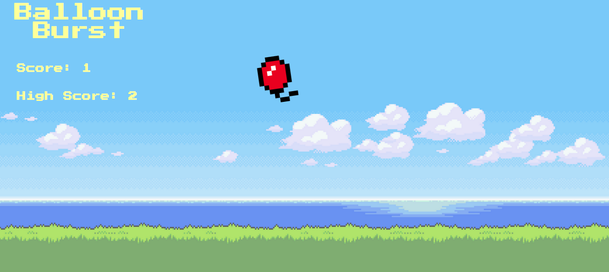

<h1>WDI-Project-1 - Balloon Burst</h1>

</img>

<h2>Introduction</h2>

This is my first project for the Web Development Immersive course at General Assembly in London. Balloon Burst started out with inspiration from the popular phone game Fruit Ninja. As the game was planned and developed, it was tweaked to have balloons rather than fruit, and for the balloons to travel to the top of the board rather than fall back again after a certian distance. 

You can see a working version of the game <a href="https://serene-river-15658.herokuapp.com/">here</a>.

You can see the code for the game <a href="https://github.com/AlexYeates/wdi-project-1">here</a>.

<h2>How to play</h2>

The aim of the game is to pop the balloons as they appear with your cursor before they reach the top of the screen. 

The balloons initially spawn at an interval of one second, which decreases every time you collect 25 points. Each balloon is worth one point. 

If you let one balloon reach the top then the game is over and your high score is stored. A reset button appears to give you the option of starting again. 

<h2>Project Brief</h2>

- To build a game using HTML, CSS, Javascript and jQuery over the period of one week.
- The game should either support two players or beat the computer.
- To build the game in object orientated programming if possible.

<h2>How it was built</h2>

- <a href="https://jquery.com/">JQuery</a> 
- <a href="https://daneden.github.io/animate.css/">Animate.css</a> 
- <a href="http://cssreset.com/scripts/eric-meyer-reset-css/">CSS Reset</a> 

<h2>Credits</h2>

- <a href="https://lh3.ggpht.com/M3xM9Qyb3PM_a-_H8K-ZEfZ5Np4b5lkKfvGdKnYUmwNL71Zmclss7mCsftjP7bd-uJ8=w300">8-bit Balloon Image</a> 
- <a href="ttps://suwalls.com/minimalistic/8-bit-serene-beach-26324/">8-bit Field</a>
- <a href="https://www.freesound.org/">Pop noise</a>
- GA Instructors Alex Chin and Rane Gowan.
- GA Teaching Assistants Nat Huitson and Ed Compton. 